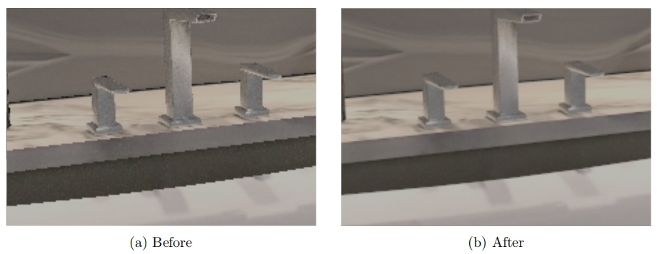
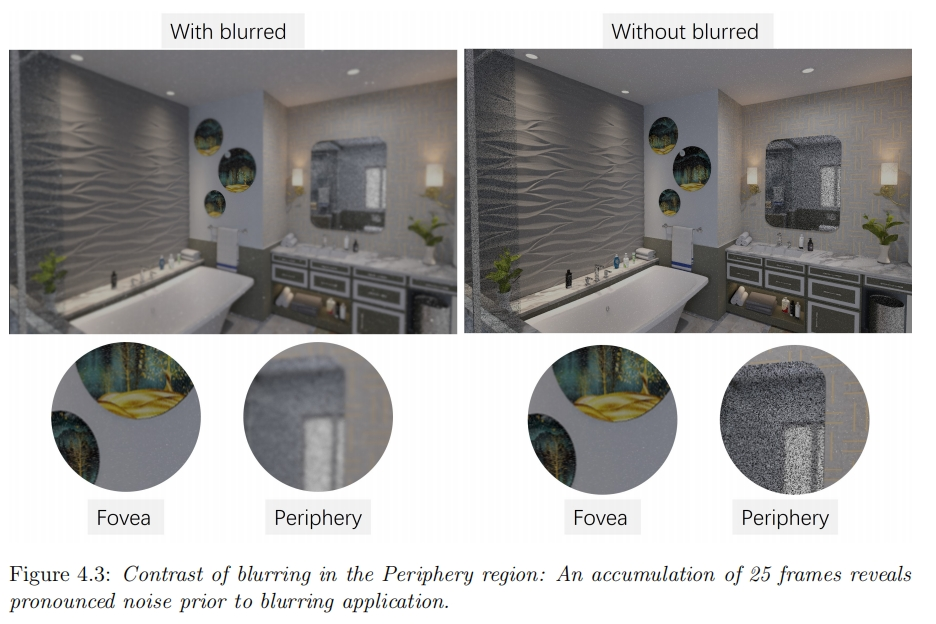
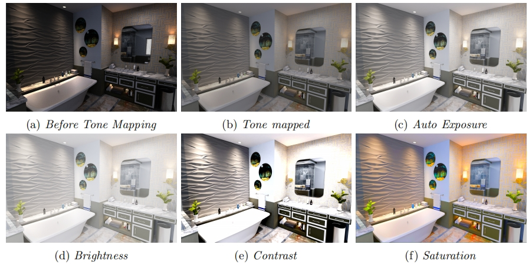
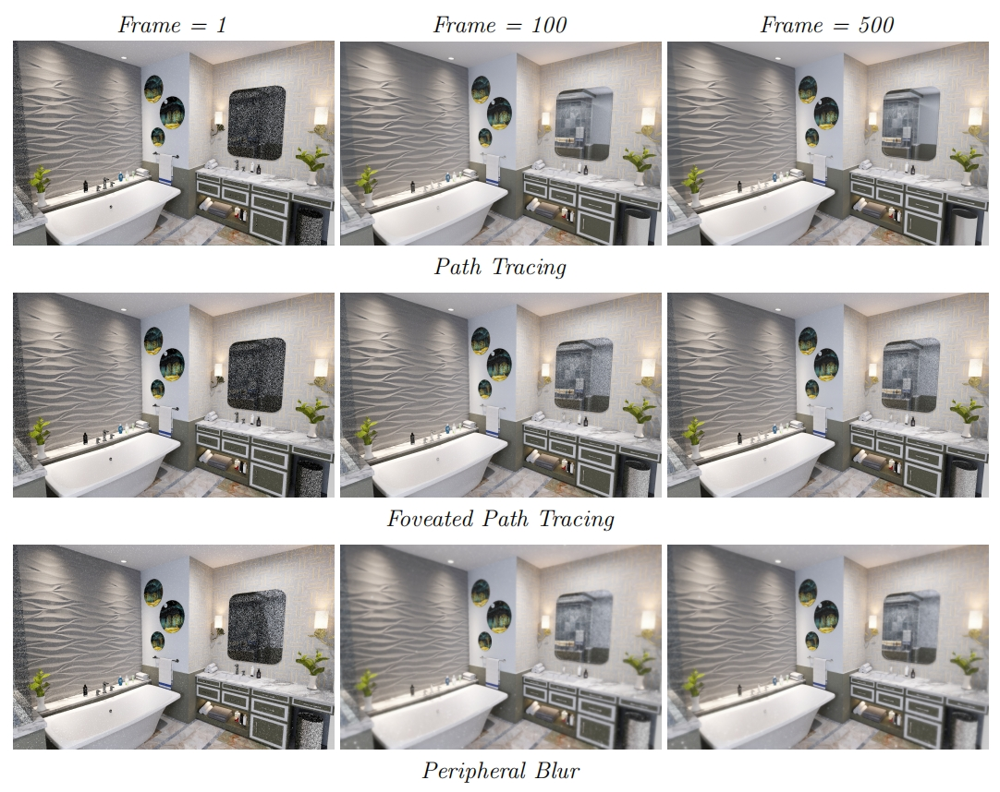
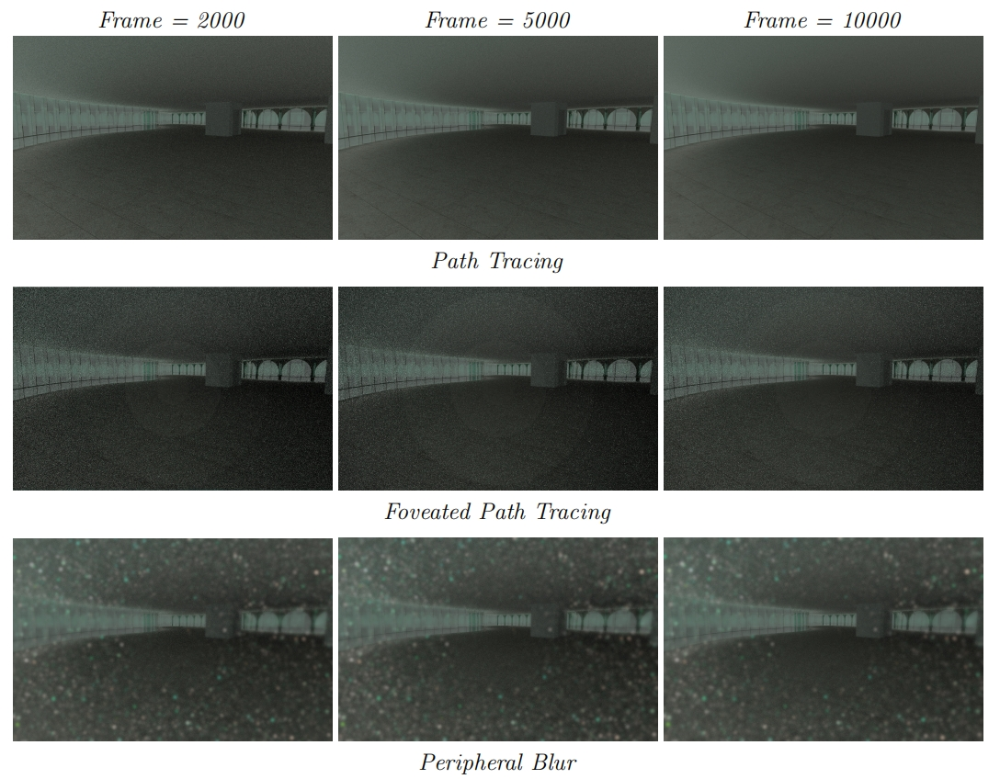
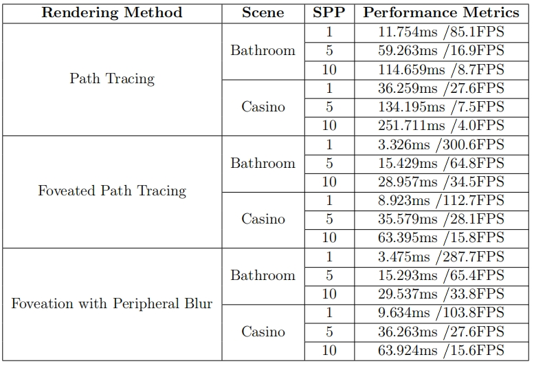

# Foveated-Real-Time-Path-Tracing

To clone the repository, run the following command:
```bash
git clone --recursive https://github.com/Zackery12138/Foveated-Real-Time-Path-Tracing.git
```

To build using cmake, follow these steps:
```bash
cd realtime_raytracer
mkdir build
cd build
cmake ..
```
To download the glTF models tested in this project, please click the link for [Grand Casino](https://skfb.ly/oKU7w) and [Bathroom Interior](https://skfb.ly/ov9DB).


## Jitter Camera Anti-Aliasing


## Peripheral Blur


## Post-Processing


## Results



## Performance

